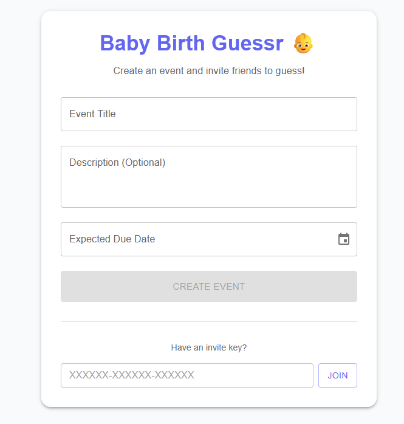

# Baby Birth Guessr 👶

A real-time baby birth guessing game! Hosts create an event, and friends can guess the birth date and weight. Updates appear instantly for everyone connected.

## Features

*   **Create Events:** Hosts can create a betting event with a title, description, and expected due date.
*   **Guess window:** Optionally set a separate guess close date (otherwise due date is used as the cutoff).
*   **Real-time Dashboard:** Watch guesses pour in live via Server-Sent Events (SSE).
*   **Visualizations:** Scatter plot of guesses (Date vs. Weight) using Recharts.
*   **Event deletion (secret key):** Events can be deleted by providing a 3-word secret key (shown at creation time).
*   **Privacy & Terms pages:** Built-in `/privacy` and `/terms` routes (linked in the footer).
*   **Cookie banner:** Informs users about essential cookies and Terms acceptance.
*   **Data retention:** Events and associated guesses are automatically deleted after 1 year.
*   **Modern Stack:**
    *   **Backend:** Rust (Axum), Diesel (Postgres), Tokio (SSE/Broadcast).
    *   **Frontend:** React 19 (Vite), TypeScript, MUI, Recharts.

## Prerequisites

*   **Rust** (stable)
*   **Node.js** (v18+)
*   **PostgreSQL**

## Getting Started

### 1. Database Setup

Ensure PostgreSQL is running and set your `DATABASE_URL` in a `.env` file or environment:

```bash
cp .env.example .env
# Edit .env with your postgres credentials
```

Migrations are embedded and run automatically on startup.

### 2. Backend

The backend serves the API and facilitates real-time updates.

```bash
cargo run
```

Server listens on `http://127.0.0.1:3000`.

### 3. Frontend

The frontend is a React SPA located in `frontend/`.

```bash
cd frontend
npm install
npm run dev
```

Open `http://localhost:5173` in your browser.

> **Note:** The Vite dev server proxies `/api` requests to the Rust backend at port 3000.

## Configuration

### Environment variables

See `.env.example` for the full list.

- **`DATABASE_URL`** (required)
  - PostgreSQL connection string.
- **`TURNSTILE_SECRET_KEY`** (required for creating events)
  - Cloudflare Turnstile server-side secret.
- **`VITE_TURNSTILE_SITE_KEY`** (required for the frontend)
  - Cloudflare Turnstile site key.
  - For local dev, you can set this in your shell, or create `frontend/.env` with:
    - `VITE_TURNSTILE_SITE_KEY=...`

## Pages

- **`/privacy`**: Privacy policy.
- **`/terms`**: Terms of service.
- **`/event?key=...`**: Event view.

If an event key is invalid (or the event was deleted), the UI shows an "Event not found" screen.

## Event deletion (secret key)

When an event is created, the API returns a **3-word secret key** (e.g. `swift-amber-otter`).

- The UI shows this key once at creation time and saves it locally in the browser.
- Anyone can delete the event if they know the key (useful if the original creator loses browser storage).

Local storage keys:

- **`cookie_consent`**: cookie/terms banner dismissal.
- **`event_admin_key_<event_id>`**: saved secret key for that event.

## Data retention

Events (and all associated guesses) are automatically deleted after **1 year**.

- A background cleanup task runs on startup and then once every 24 hours.

## Architecture

### API Endpoints

*   `POST /api/events`: Create a new event.
    *   Returns event data and the `secret_key`.
*   `DELETE /api/events/{id}`: Delete an event.
    *   Body: `{ "secret_key": "three-word-key" }`
*   `GET /api/events/by-key/{key}`: Retrieve event details by invite key.
*   `POST /api/events/{id}/guesses`: Submit a new guess.
*   `GET /api/events/{id}/guesses`: List all guesses for an event.
*   `GET /api/events/{id}/live`: **SSE** endpoint for real-time updates.

### Real-time Updates

The backend uses a `tokio::sync::broadcast` channel to publish new guesses. When a user submits a guess, it is saved to the DB and then broadcasted to all clients listening on the SSE endpoint for that specific event.

## Podman Deployment (Recommended)

We recommend using **Podman** for deployment, especially on Windows, as it offers better control through the concept of **Pods**.

### Option 1: Native Pods (Best for control)

This method runs the database and application in a single Pod, sharing the network namespace (improving performance and simplifying networking).

1.  Ensure you have **Podman** installed.
2.  Run the provided script:

**Bash (Git Bash/WSL):**
```bash
./podman-deploy.sh
```

**Features included:**
*   **SSL/HTTPS:** Includes a Caddy sidecar on port 443 (Self-signed).
*   **DDNS:** Updates Cloudflare DNS automatically (if configured).

**Production Setup:**
1.  **Router:** Forward External Port **443** -> Internal Port **8443** (Port 443 is privileged, so we use 8443 locally).
2.  **Cloudflare:** Set SSL/TLS mode to **Full** (allows self-signed certs).


### Option 2: Podman Compose

If you prefer the Compose workflow:

1.  Ensure you have `podman-compose` installed.
2.  Run:

```bash
podman-compose up --build
```

(Or `docker-compose up --build` if using Docker).

The application will be available at `http://localhost:3000`.

The setup:
-   **Stage 1:** Builds React frontend.
-   **Stage 2:** Builds Rust backend.
-   **Stage 3:** Runtime image (Debian).
-   **Database:** Postgres 15 (auto-migrated on startup).

## License

MIT
